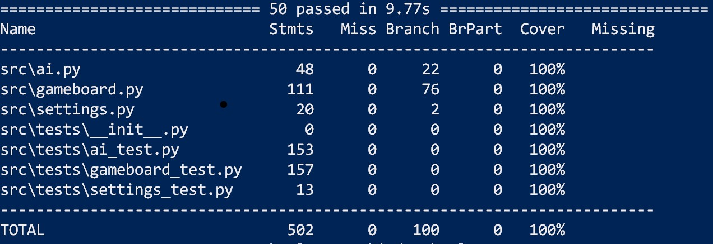

# Testausdokumentti tiradev

Ohjelmistoa testataan 50 testin verran ja niiden kattavuus toimintojen osalta on coveragen mukaisesti on 100%

  

Suurin osuus testeistä kohdistuu luokkaan Gameboard, sillä siihen sisätyvät pelin toimivuuden osalta olennaiset toiminnot. 
Siinä testataan pelilaudan ja pelin toimivuutta, kuten voittoisuuden tarkistaminen, pelimerkkien asettaminen, pelivuorot jne. 
Luokan Ai testit keskittyvät tekoälyn toimivuuden testaamiseen. Sen testit koostuvat pelitilanteiden rakentamisesta, tarkastamisesta ja arvioimisesta. 
Tällaisia ovat muun muassa tietyn pelitilanteen pisteyttäminen ja pelin päättymiseen liittyvät arviot, kuten varman voiton löytymisen varmistaminen. 
